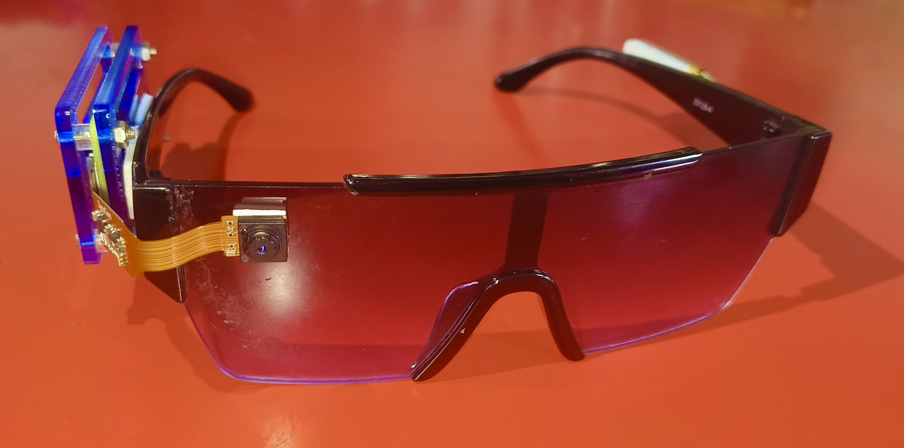
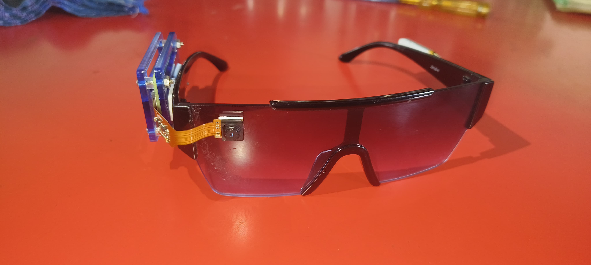
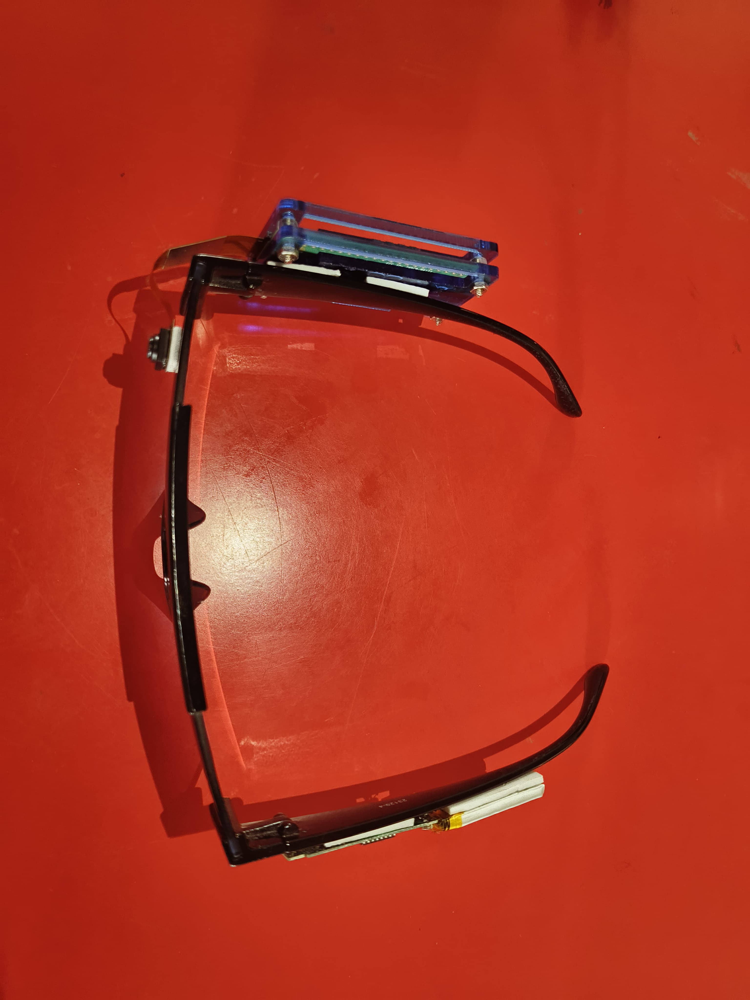

# AI-Powered Smart Glasses for Vision Assistance

This project is a prototype of an AI-powered smart glasses system for vision assistance. It consists of three main components:

1.  **Smart Glasses Camera App (`raspberry_pi_camera_app`)**: A Flutter application designed to run on a Raspberry Pi connected to a camera. It captures the video feed from the user's perspective.
2.  **AI Processing Backend (`Smart Vision Assistant`)**: A set of Python scripts that perform the core AI processing. This includes object detection using YOLO, interaction with the Gemini API for more complex scene understanding, and text-to-speech output.
3.  **Web Interface (`CamML_APP`)**: A web application that can be used to view the video feed, see the AI's analysis, and configure the system.

## Architecture

The three components are designed to work together as follows:

1.  The **Smart Glasses Camera App** captures the video feed and streams it to the **AI Processing Backend**.
2.  The **AI Processing Backend** receives the video stream. For each frame, it performs the following steps:
    *   Runs object detection using YOLO to identify common objects.
    *   Sends the frame and YOLO detection results to the Gemini API for a more detailed description of the scene.
    *   Takes the description from the Gemini API and converts it to speech using the `speak_output.py` script.
    *   The audio is then sent back to the smart glasses to be played to the user.
3.  The **Web Interface** provides a way to monitor the system. It displays the video feed from the smart glasses, the bounding boxes from the YOLO detection, and the description from the Gemini API.

## How to Run the System

Currently, the three components are separate projects and need to be run independently. To create a fully functional system, the following modifications are required:

### 1. Smart Glasses Camera App (`raspberry_pi_camera_app`)

The Flutter app needs to be modified to stream the camera feed to the backend server. This can be done using a library like `camera` to get the camera stream and then sending the frames over a WebSocket or a WebRTC connection to the backend.

### 2. AI Processing Backend (`Smart Vision Assistant`) & Web Interface (`CamML_APP`)

The `CamML_APP` should be extended to act as the central server. Here's how:

1.  **Integrate `Smart Vision Assistant`**: The Python scripts from `Smart Vision Assistant` should be integrated into the `CamML_APP` Flask/FastAPI application.
2.  **Create an API Endpoint for Video Streaming**: An endpoint (e.g., a WebSocket endpoint) needs to be created in `app.py` to receive the video stream from the smart glasses.
3.  **Process the Video Stream**: The video stream from the glasses should be fed into the `yolo_detect.py` and `gemini_api.py` scripts.
4.  **Create an API Endpoint for Results**: An endpoint needs to be created to send the results (the description from Gemini API) back to the smart glasses for text-to-speech output.
5.  **Update the Web Interface**: The `index.html` and associated JavaScript should be updated to display the video feed and the AI analysis results in real-time.

By following these steps, you can connect the different parts of this project into a single, functional system.

## Project Images

Here are some images related to the project:

